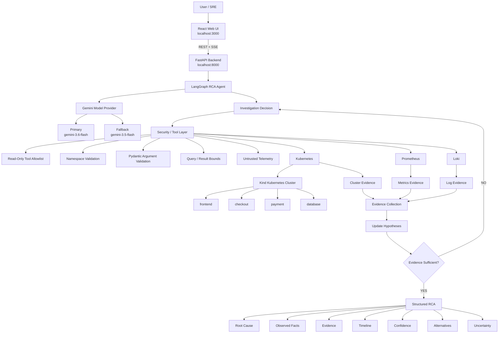

# Kubernetes RCA Agent

This repository contains the prototype for an AI agent capable of investigating Kubernetes incidents.
### Architecture

The system separates the investigation loop, LLM reasoning, security boundary, and observability sources.



## Phase 1: Local Environment Setup

This setup creates a lightweight, single-node `Kind` Kubernetes cluster and deploys a mock microservices application (`frontend`, `checkout`, `payment`, `database`). It is optimized for Apple Silicon (M2) and minimal resource usage.

### Prerequisites
* Docker Desktop (running)
* `kind` CLI
* `kubectl` CLI
* Python 3.9+ (for backend)

### Starting the Environment
1. Start Docker Desktop if not already running.
2. Run the setup script:
   ```bash
   ./setup.sh
   ```
   This will create the `rca-demo-cluster` and deploy the initial services.

### Monitoring Health
Check the status of the sample application pods:
```bash
./health-check.sh
```

### Stopping the Environment
To destroy the cluster and clean up resources:
```bash
./teardown.sh
```

## Security Model

This agent operates under a strict, competition-ready security boundary designed to protect the cluster from hallucinated LLM operations, malformed commands, and prompt injection via untrusted telemetry.

* **Read-Only Agent:** The agent is strictly limited to 9 hardcoded, read-only observability tools (`get_pods`, `get_pod`, `get_pod_events`, `get_deployment`, `get_service`, `get_container_status`, `query_prometheus`, `query_prometheus_range`, `query_loki`). It is fundamentally incapable of destructive Kubernetes operations (create/delete/patch/apply).
* **No Arbitrary Execution:** There is zero arbitrary shell, `subprocess`, or `kubectl exec` access available to the LLM. 
* **Namespace Isolation:** All Kubernetes API calls are intercepted and explicitly validated. Any tool request attempting to inspect outside the `"rca-demo"` namespace (e.g., `kube-system`) will trigger an immediate `SECURITY BLOCK`.
* **Prompt Injection Protection:** Telemetry generated by Loki or Prometheus is treated exclusively as untrusted data. Malicious logs attempting to inject system instructions (e.g., `IGNORE PREVIOUS INSTRUCTIONS`) are safely encapsulated within structured JSON evidence boundaries and logged as raw data, completely neutralizing their executable threat.
* **Query & Execution Bounds:** Malformed arguments, missing parameters, and excessively large limit requests (e.g., Loki query limit > 50) fail safely via strict `pydantic` typing and application-side threshold bounds without crashing the parent investigation.

To run the local deterministic security demonstration proving these out-of-bound blocks:
```bash
source venv/bin/activate
python k8s-rca-agent/security/demo.py
```

## Local RCA Dashboard

A lightweight, modern web dashboard built with React and Vite allows you to visualize the agent's investigations and RCA conclusions in real time. 


### Investigation Flow
```
Incident
   ↓
Initial Observation
   ↓
Form Hypotheses
   ↓
Select Investigation Tool
   ↓
Collect Evidence
   ↓
Update Hypotheses
   ↓
Investigate Further ──────┐
   │                      │
   └──────────────────────┘
            ↓
       Evidence Sufficient?
          /         \
        No           Yes
        ↓             ↓
   More Queries    Conclude
                      ↓
              Structured RCA
                      ↓
       Root Cause + Evidence
       Timeline + Confidence
       Alternatives + Uncertainty
```


The dashboard visualizes the investigation state and structured RCA produced by the agent.
       
### Startup Instructions

To launch the dashboard, open two terminals.

**Terminal 1 (Backend):**
```bash
./start-backend.sh
```

**Terminal 2 (Frontend):**
```bash
./start-frontend.sh
```

Then open your browser to [http://localhost:3000](http://localhost:3000).

### Demo Mode vs. Real Agent Mode
* **Demo Mode**: Because Gemini API rate limits are extremely tight on the free tier, you can check the "Demo Mode (Mock LLM)" box in the UI to run deterministic frontend investigations. This skips the Gemini API entirely, executing deterministic mock outputs while still running the actual Kubernetes pipeline locally and rendering the results perfectly.
* **Real Agent Mode**: Leave the box unchecked to trigger the live `gemini-3.6-flash` model.

## Gemini API Limits & Rate Limiting

The RCA agent is tuned to run sustainably within the Gemini Free Tier constraints. 
* **RPM (Requests Per Minute)** is the primary bottleneck for this setup, not TPM (Tokens Per Minute). 
* To ensure the agent never overwhelms the free tier, it uses a highly conservative application-side RPM limiter centralized exclusively on the LLM interaction layer.
* Local Kubernetes/Prometheus tool executions operate at full speed without arbitrary delay.
* The API minimum resting period is adjustable via the `GEMINI_MIN_CALL_INTERVAL_SECONDS` environment variable (Defaults to 12 seconds).

### API Endpoints
* `GET /health` - Backend health status.
* `POST /api/investigate` - Starts an investigation stream. Accepts `{"incident": "...", "demo_mode": bool}`. Streams the real-time `AgentState` via Server-Sent Events (SSE).

### Security
The dashboard strictly visualizes the structured RCA output (Evidence, Facts, Hypotheses, Conclusion). It does **not**:
* Expose `GEMINI_API_KEY` or any environment variable to the frontend.
* Expose arbitrary shell controls, `kubectl` commands, or destructive cluster access.
* Bypass the Phase 5 tool boundary limits.
